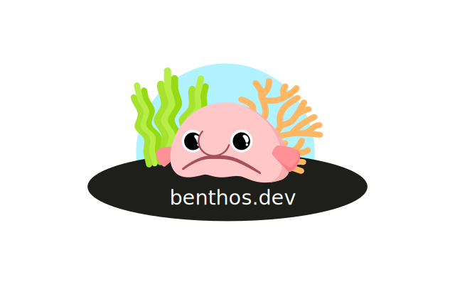

### Data Streaming At Scale With Benthos

<!--truncate-->

Optum's [Open Source Program Office (OSPO)](https://opensource.optum.com/blog/2021/08/24/OSPO%20culture) recently launched an Open Source sponsorship program, committing an initial $50K total donations to external Open Source projects of notable merit. [Benthos](https://benthos.dev/), the stream processor for mundane tasks, was selected as the first project to receive a donation through this program.

This article is the first part of a longer series of posts about Benthos, where I'll share some insight into why we decided to adopt Benthos as the core data streaming engine for Optum's new [Data Mesh](https://martinfowler.com/articles/data-mesh-principles.html) solution.

Benthos is a stateless data streaming engine written entirely in [Go](https://go.dev/) and compiled as a single static binary. It enables data engineers to configure a pipeline of processing steps that are to be executed on messages as they flow from the source to the sink during runtime. Through back pressure mechanisms, it ensures at-least-once delivery when connecting to sources and sinks which support this, without persisting in-flight messages in any temporary storage. It has a wide range of [builtin connectors](https://www.benthos.dev/docs/about/#components) that are expanding constantly and it's very easy to [deploy](https://www.benthos.dev/docs/guides/getting_started) in production. This project was started over 6 years ago by [Ashley Jeffs](https://www.jeffail.uk/) (he goes by Ash), who is still maintaining it and is currently [preparing](https://github.com/Jeffail/benthos/issues/1071) for the 4th major release.

At Optum, we have large volumes of disperse data in various formats spread across many different datastores, some of which are legacy systems that are slowly getting phased out. Benthos allows us to perform data movement from these systems to modern cloud-based datastores, where data analysts can perform their work more efficiently. While Benthos doesn't provide connectors for all the types of sources and sinks that we need, it does come with a rich [Golang API](https://pkg.go.dev/github.com/Jeffail/benthos/v3/public/service) for writing custom plugins that allow us to expand its functionality and tailor it for our needs.

Since Benthos can easily be run in Kubernetes clusters, it enables us to build robust and efficient systems for terabyte-size workloads which scale horizontally. In order to monitor our production workloads, we leveraged the various Prometheus-compatible [metrics](https://www.benthos.dev/docs/components/metrics/about) and Jaeger-compatible [traces](https://www.benthos.dev/docs/components/tracers/about) that Benthos emits for each component of its configured processing pipeline. For complex workflows, it can be configured to add extra metrics using the [`metric` processor](https://www.benthos.dev/docs/components/processors/metric).

Additionally, we use distributed event streaming platforms, such as [Apache Kafka](https://kafka.apache.org/), as message buses for various realtime and batch ETL (Extract, Transform, Load) workflows. Benthos comes with an embedded DSL called [Bloblang](https://www.benthos.dev/docs/guides/bloblang/about), which lets us express complex transformations of structured data, such as schema migrations and validations.

During our Benthos adoption, we pushed upstream several new adaptors and features that were quickly approved and merged. Getting code merged into Benthos has been one of my best experiences in contributing to Open Source so far.

[Benthos Studio](https://studio.benthos.dev/) has been released recently to aid users in designing, visualising and testing Benthos streaming pipelines and it's proving very valuable when building new pipelines from scratch or navigating complex ones.

If you'd like to learn more about Benthos, Ash's [YouTube channel](https://www.youtube.com/c/Jeffail) is a good place to start. Also, there is a vibrant [community](https://www.benthos.dev/community) around it, where Ash and other users like myself are available to answer any questions that you might have.

Try [Benthos](https://benthos.dev/) today if you haven't already!
