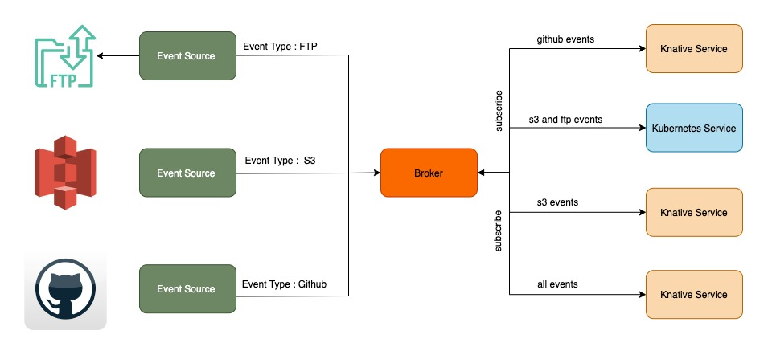

### Knative

<!--truncate-->

Knative enables you to run a serverless platform on your own terms. It has 2 independent components, Serving and Eventing. Serving runs your application as a serverless container in a kubernetes cluster, while eventing provides the tooling to source and orchestate events to your application.

Once you get past the initial attraction of scale to 0 that serving provides, you will quickly take notice of knative eventing capabilities mentioned below

### Event Source

Component provided by Knative Eventing to source events from a actual event producer like kafka/rabbit mq/github etc. and deliver it to a addressable resource (any resource which has a uri, can be knative service/kubernetes service or just an uri). There is an event source for almost all commonly used event producers. Either its community maintained or custom implementation.

### Brokers and Triggers

Source delivers events 1-1. A fan out model with filters would be great for orchestrating events. Thats what Brokers and Triggers provide. Broker as the name suggest is the event ingress and hub, triggers route the events based on filters.

For brokers, triggers and sources to work in harmony they need to speak the common language and that is provided by [Cloud Events](https://cloudevents.io).

Below image shows how the events are sourced and routed to different knative and kubernetes service.

### What's a Knative Channel

Brokers, as pointed above is the events hub, so it needs a state store, which is provided by `Channels`. By default Brokers use InMemory Channels. In a production environment, you would need a more robust store, for which Knative provides `KafkaChannel` and `NatsChannel`. Its worth mentioning here that there are broker implementations (kafka broker and rabbit mq broker) which dont require channels.

### Kafka Topic Channel

The kafka channel or kafka broker would need admin rights as topics are created for each resource. This would require the Knative operator to main a kafka cluster, which might be cumbersome. Hence we implemented a custom knative channel based on `kafka topic`.

Kafka Topic Channel or ktc conforms to the knative spec, hence brokers and triggers would work as is. It is a single tenant solution, each Broker resource would require separate kafka topic and subsequent kafka topic channel. The channel instance would be created in the user namespace.

[Details with examples](https://github.com/Optum/kafka-topic-channel)

Bring your own kafka topic, get a knative channel!

#### Related Resources

- [Kubecon demo on cloud events, knative brokers and triggers](https://www.youtube.com/watch?v=gXuW9mvj6xM&list=PLnPNqTSUj2hKH5W7GWOZ-mzcw4r3O4bHj&index=2&t=14s)
- [Event Sources](https://itsmurugappan.medium.com/writing-custom-knative-eventing-sources-92f6904131ad)
