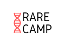
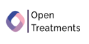

## Optum Open-Source Sponsorship Program

We are pleased to provide regular sponsorship through our **open-source giving program**. As open-source leaders, we are committed to furthering the development of key open-source works in our ecosystem. We distribute $50K annually to selected projects.

| Date          |                 Sponsorship Recipient                 |
| :------------ | :---------------------------------------------------: | :--------------------------------------------------------: |
| January 2022  |                   To be determined                    |                                                            |
| December 2021 | https://rarecamp.org/ https://www.opentreatments.org/ |  |
| November 2021 |               https://www.benthos.dev/                |                                   |
